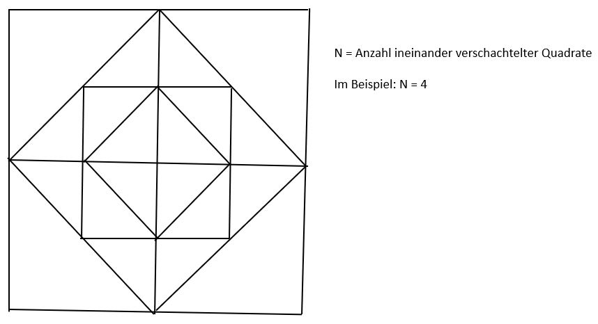

# Linus-PE-2022
* Assignment
* Algorithm
* Instructions

# Assignment
This program should create a printable bitmap graphic that looks like the picture below.
Before rendering the picture the program will ask how many rectangles should be generated.


# Algorithm
Using recursion the program will generate a rectangles, while n is the number of execution cycles.
The function passes the edges of every rectangle and after every iteration cycle the new point will be 
the middle of the two points

pseudo-code
```c
drawStructure(n, A, B, C, D){
    
  if n == 0: return;
  
  #Edge A(0/0) B(0/1000) C(1000/1000) D(1000/0)
  
  drawRecangle(A, B, C, C)
  
  A = middleOfVectors(A, B)
  B = middleOfVectors(B, C)
  C = middleOfVectors(C, D)
  D = middleOfVectors(D, A)
  
  #Edges A(0/500) B(500/1000) C(1000/500)
  drawStructure(n, A, B, C, D)
          
}
```

# Instruction

Requirements:
* build-essentials
* gcc

This program was tested on Ubuntu 22.04 with ggc version 11.3.0
## Compile
```bash
gcc main.c include/file_handler.c include/graphics_handler.c
```
## Execute
```bash
./a.out
```

When executing the file with CLion the generated file will appear inside the folder cmake-build-debug